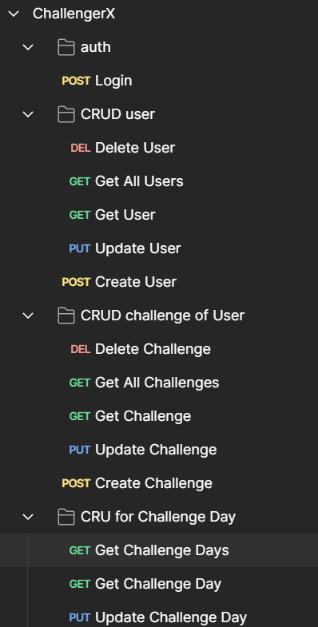

# Challenger-X App

## Overview

Welcome to the Challenger-X app! This project focuses on providing users with a platform to set and track personal goals through challenges. The app offers a dynamic experience where users can create, update, retrieve, and delete both user accounts and challenges. The endpoints are designed to empower users in actively pursuing and accomplishing their individual goals within the Challenger-X app.

## API Documentation

### User Endpoints

1. **GET /users**
    - Retrieve a list of users with optional pagination.

2. **GET /users/{userId}**
    - Retrieve user details by user ID.

3. **POST /users**
    - Create a new user.

4. **PUT /users/{userId}**
    - Update user details by user ID.

5. **DELETE /users/{userId}**
    - Delete a user by user ID.

### Challenge Endpoints

1. **POST /users/{userId}/challenges**
    - Create a new challenge for a specific user.

2. **GET /users/{userId}/challenges**
    - Retrieve a list of challenges for a specific user.

3. **GET /users/{userId}/challenges/{challengeId}**
    - Retrieve challenge details by challenge ID for a specific user.

4. **PUT /users/{userId}/challenges/{challengeId}**
    - Update challenge details by challenge ID for a specific user.

5. **DELETE /users/{userId}/challenges/{challengeId}**
    - Delete a challenge by challenge ID for a specific user.

### Challenge Day Endpoints

1. **GET /users/{userId}/challenges/{challengeId}/days**
    - Retrieve all days of a challenge.

2. **GET /users/{userId}/challenges/{challengeId}/days/{challengeDayId}**
    - Retrieve details of a specific challenge day.

3. **PUT /users/{userId}/challenges/{challengeId}/days/{challengeDayId}**
    - Update the status of a specific challenge day.

### Getting Started

To start using the Challenger-X app, follow these steps:

1. **Create a User Account:**
    - Use the `POST /users` endpoint to create a new user account.

2. **Set Personal Challenges:**
    - Utilize the `POST /users/{userId}/challenges` endpoint to create challenges associated with your user account.

3. **Track Progress:**
    - Regularly use the app to update challenge details and track your progress.

4. **Explore Endpoints:**
    - Refer to the provided API documentation for a comprehensive guide on available endpoints.

## License

This project is licensed under the [MIT License](LICENSE).
